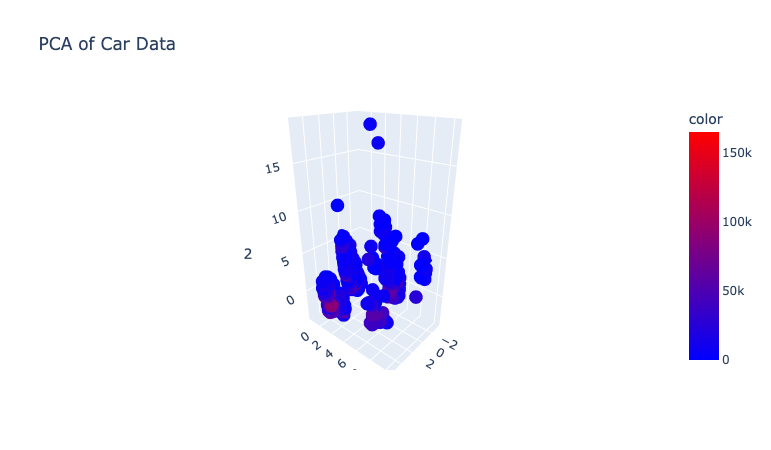
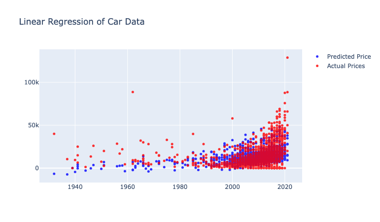
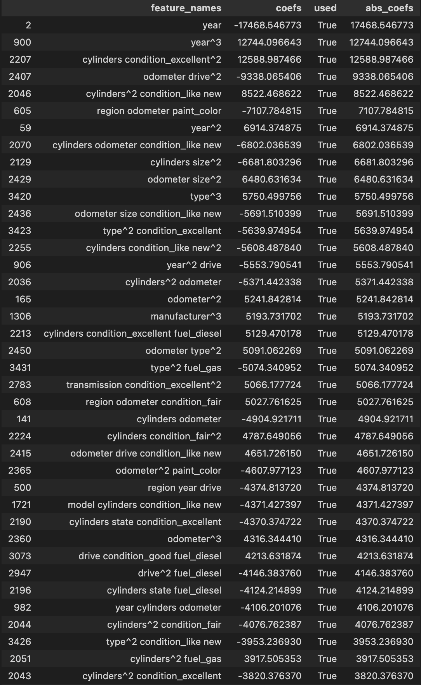

# Used Car Analysis and Model

## Purpose:

  The purpose of this repository is to provide a home for my analysis and model of a large dataset containing entries on used car sales. The goal of this is to provide a working model and some inferences that could be used by car salespeople to price vehicles based on differing criteria.

## Deliverables:

  The first deliverable for this project is a writeup containing analysis and suggestions for further research. The second deliverable for this project is a workbook providing a pipeline and model for predicting the prices of cars based on provided criteria.

## Process:

  The process was first to perform data cleaning operations on the set. The dataset was large and had some obvious errors within it. These errors included astronomically high prices and missing pieces of critical data. To fix this, the data was pruned by removing all rows of with missing values, and pruning the top one thousandth percent of all rows sorted by price. This left us with about 75,000 rows of data.

  Next, we performed a cursory analysis of the data and any patterns that were within. We scaled the data and performed Principal Components Analysis to determine if there were any groups or trends that we would be encountering later. Finding some trends, we also performed a small boxplot to determine the relative distribution of prices quickly.

  Finally, we built a pipeline to feed data through for the purposes of building a linear regression model and extracting important components from. The number of features permitted on the model was left unlimited, and appeared to settle at about 350, inclusive of features we created as part of our pipeline.

## Results:

Our PCA analysis showed 5 definite groups and 2 potential groups within the scaled data. There was a trend of higher valued vehicles being closer to the bottom of the chart. This shows definite trends in our data that we can determine with further analysis.

Our findings were significant. The year, the drive style, cylinders, odometer, condition, type, and model all appeared in the top features of the model. The year especially showed a strong trend with the price of a car, and was the X axis of the graphs we produced later on. 

Our development model had some difficulty predicting the price of outliers in age or price, but is well able to predict the pice of most cars based on the characteristics.

## Conclusions:

The year of the car had the largest impact on the predictive ability of the linear regression model, indicating the highest impact on the data. The older the car, the lower the price. The condition being excellent or like new also had a large positive impact on the price. The odometer also has a large negative impact on the price. Type of vehicle has a large positive impact on price. Interestingly, the drive style of the vehicle also has an impact on price, with automatics being noticeably more valuable

For more detailed 

### Addendum

1. As an exercise, we have also included a very demanding model that trains on the entire remaining dataset. In theory, this should produce better results. In practice, it seems to overfit the model somewhat.

2. A table of coefficients is listed below. The higher the abs_coefs, the higher the impact on the data. Negative coefs have a negative impact on data. Some data is squared, cubed, or in combinations with other data points, so analyze carefully.

